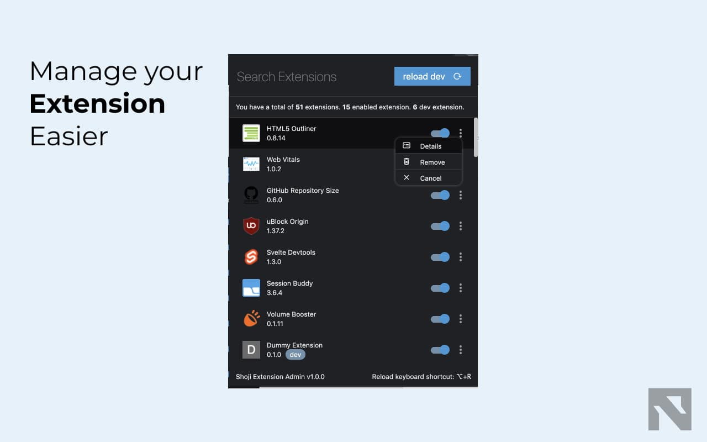

# Shoji Extension Admin

[](https://www.gnu.org/licenses/gpl-3.0)  

Available on [chrome webstore]()

What this help you with:

- reload dev extension with *shortcuts or button
- search extension
- enable or disable extension
- open details or remove extension

What it cannot do  (chrome doesn't provide public API for this) :
- reload dev extension with manifest
- pin or unpin extension 



Notes:
1. default shortcut is "Alt + R" or "Option + R" on Mac

## Changelog

[view changlog](https://github.com/noxasch/shoji-extension-admin/blob/master/CHANGELOG.md)

## Build from source
1. clone to your local repo and cd to inside the project folder and run the following:
```
npm install
npm run build
```

2. Open you extension tab and turn on "developer mode".
3. "Load unpacked" and select the `dist/debug` folder

## License

[GPL3](https://github.com/noxasch/shoji-extension-admin/blob/master/LICENSE)
